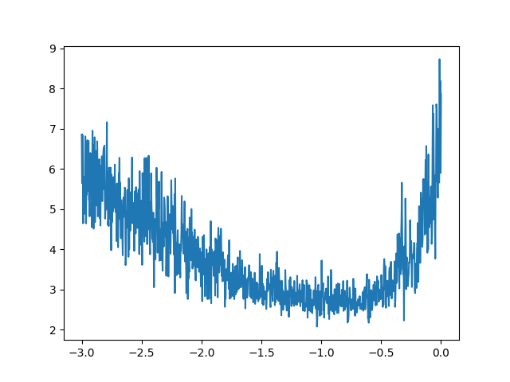
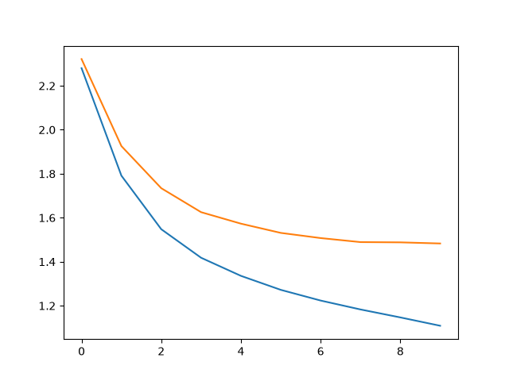

# Autoregressive Sequence Models

This folder contains implementations of character-level autoregressive sequence models built from scratch in PyTorch, following Karpathy's Makemore and GPT tutorials.

---

## Implementations

### 1. Bigram Language Model
* **Path:** [bigram/main.py](./bigram/main.py)
* **Overview:** 
  * A simple character-level bigram language model trained on a dataset of names ([names.txt](./names.txt)).
  * Implemented using two methods:
    1. **Counting & Lookup Table:** Directly counting bigram frequencies from the text, storing them in a 27x27 matrix, and normalizing to sample next characters.
    2. **Single-Layer Neural Network:** A single linear layer that takes a one-hot encoded character and outputs logits for the next character prediction, optimized via gradient descent with cross-entropy loss.
* **Visualization:** The 27x27 grid of bigram frequencies and counts:
  

    
  

### 2. Multi-Layer Perceptron (MLP) Language Model
* **Path:** [MLP/main.py](./MLP/main.py)
* **Overview:**
  * Implements a character-level language model based on the Bengio et al. 2003 paper.
  * Embeds characters into a low-dimensional space (e.g. 10D), concatenates them as a context window (block size of 3 characters), and feeds the context through a hidden layer with a `tanh` activation to predict the next character.
  * Trained using mini-batches and evaluated on train/dev/test splits.

### 3. miniGPT (Decoder-Only Transformer)
* **Path:** [miniGPT/bigram.py](./miniGPT/bigram.py) | [miniGPT/miniGPT.ipynb](./miniGPT/miniGPT.ipynb)
* **Overview:**
  * A full character-level decoder-only Transformer (GPT) model trained on Tiny Shakespeare ([miniGPT/input.txt](./miniGPT/input.txt)).
  * Features causal self-attention, Multi-Head Attention, residual connections, Layer Normalization, FeedForward networks, and stacked transformer blocks to model sequence context.
* **Training Loss:** The training loss curve of miniGPT on Tiny Shakespeare:
  

    
  

