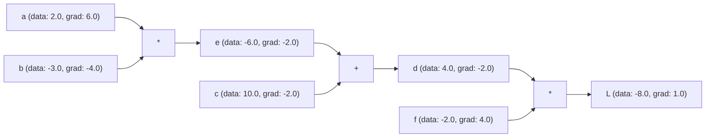

# micrograd

This is an implementation of a scalar-valued autograd engine and neural network library, following Andrej Karpathy's micrograd tutorial. It implements backpropagation (automatic differentiation) over a dynamically built directed acyclic graph (DAG) of scalar values.

---

## Architecture & Components

### 1. Scalar Autograd Engine (`Value`)
The core class is `Value` (defined in [main.py](./main.py)), which wraps a python float and tracks:
* `.data`: The actual scalar value.
* `.grad`: The derivative of the final output (e.g. loss `L`) with respect to this value.
* `._prev`: A set of parent nodes in the computation graph.
* `._op`: The operation that created this node (e.g. `+`, `*`, `tanh`, `**`).

It supports standard mathematical operators (`__add__`, `__mul__`, `__sub__`, `__pow__`, and activation function `tanh()`). Every operation defines its own chain rule derivative inside a nested `_backward()` lambda, which is recursively called during backpropagation.

Topological sort is used to order the DAG, allowing backpropagation to run sequentially from the output node back to all inputs by calling `L.backward()`.

### 2. Neural Network Library (`Neuron`, `Layer`, `MLP`)
Using the `Value` class, the library constructs a simple neural network stack:
* **Neuron:** Represents a single neuron with `w` weights (randomly initialized) and a bias `b`. It computes `tanh(sum(w_i * x_i) + b)`.
* **Layer:** A collection of independent neurons.
* **MLP:** A Multi-Layer Perceptron containing a stack of sequential layers.

---

## Example Computation Graph

Below is the visualization of the calculation graph for the expression `L = f * (c + (a * b))`:



The Graphviz dot source representing this graph is saved in the [graph](./graph) file.

---

## Usage & Experiments

### Training a Toy MLP
[main.py](./main.py) shows how to define an MLP, calculate a squared error loss on a dataset, and optimize the weights using simple gradient descent:

```python
xs = [[2.0, 3.0, -1.0], [3.0, -1.0, 0.5], [0.5, 1.0, 1.0], [1.0, 1.0, -1.0]]
ys = [1.0, -1.0, -1.0, 1.0]

for k in range(20):
    # Forward pass
    ypreds = [n(x) for x in xs]
    loss = sum([(yout - ygt) ** 2 for ygt, yout in zip(ys, ypreds)])

    # Zero grad
    for p in n.parameters():
        p.grad = 0.0

    # Backward pass
    loss.backward()

    # Gradient descent update
    for p in n.parameters():
        p.data += -0.05 * p.grad
```

### Verification with PyTorch
[main.py](./main.py) also includes a cell comparing the outputs and gradients calculated using our manual `Value` class with PyTorch's native autograd framework to verify correctness.
